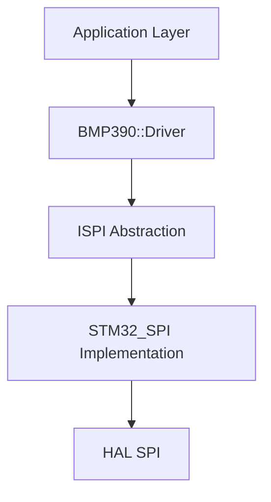

# BMP390 STM32 Driver

A modern, high-performance C++ driver for the Bosch BMP390 barometric pressure and temperature sensor, optimized for STM32 microcontrollers.

## 🚀 Overview

This driver providing a clean, object-oriented interface for the BMP390 sensor. It is designed to be highly portable and easily integrated into STM32CubeIDE projects using an abstract SPI interface.

### Key Features
- **Modern C++**: Built with C++17/20 standards in mind.
- **Hardware Abstraction**: Uses a thin SPI abstraction layer for easy porting.
- **High Precision**: Implements Bosch's standard compensation formulas for temperature and pressure.
- **Versatile**: Supports Forced and Normal operation modes.
- **Clean Structure**: Organized specifically for STM32CubeMX/CubeIDE compatibility.

## 📂 Project Structure

```text
BMP390_Driver/
├── Inc/           # Header files (.h)
├── Src/           # Source files (.cpp)
├── .gitignore     # Tailored for STM32/CubeIDE
└── README.md      # You are here
```

## 🛠 Getting Started

### 1. Integration
Copy the `Inc/` and `Src/` folders into your STM32 project (typically under `Core/` or `Drivers/`).

### 2. Include Paths
Add the `Inc/` directory to your project's include paths in STM32CubeIDE:
`Properties -> C/C++ General -> Paths and Symbols -> Includes`

### 3. Usage Example
Initialize the SPI interface and pass it to the driver:

```cpp
#include "bmp390_driver.h"
#include "istm32_spi.h"

// Initialize STM32 SPI wrapper
STM32_SPI spi_bus(&hspi1); 

// Create BMP390 instance
BMP390::Driver sensor(spi_bus);

if (sensor.init() == BMP390::Status::OK) {
    float temp, pressure;
    sensor.getTemp(temp);
    sensor.getPress(pressure);
}
```

## 📐 Architecture



## 🛡 License
This project is provided as-is. Please consult the sensor datasheet for manufacturer-specific requirements.
